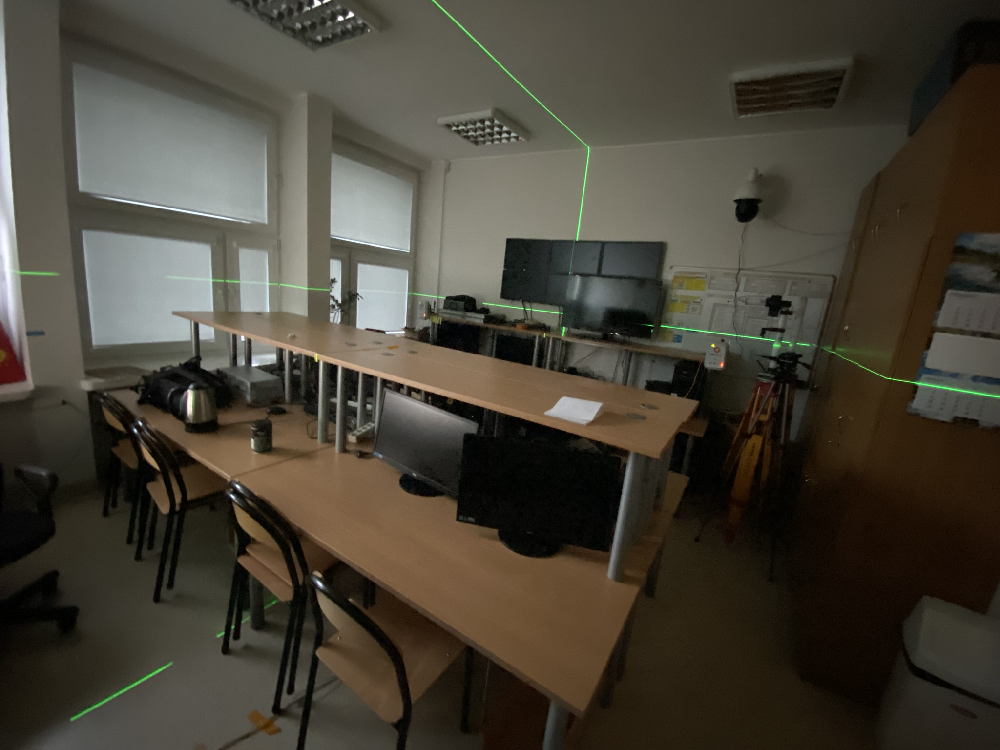
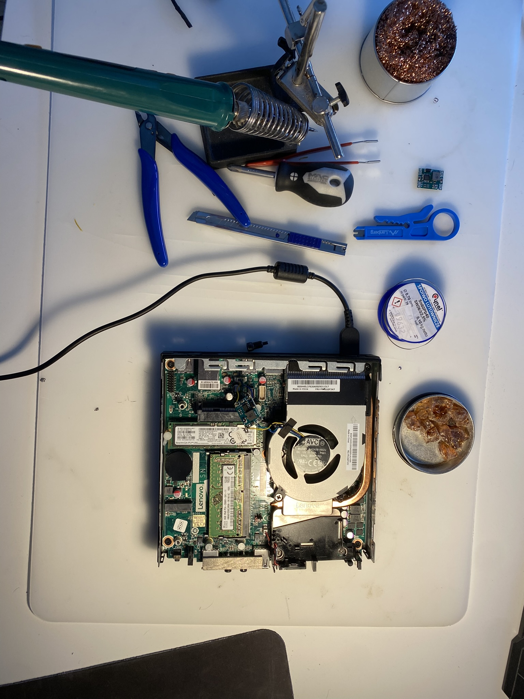
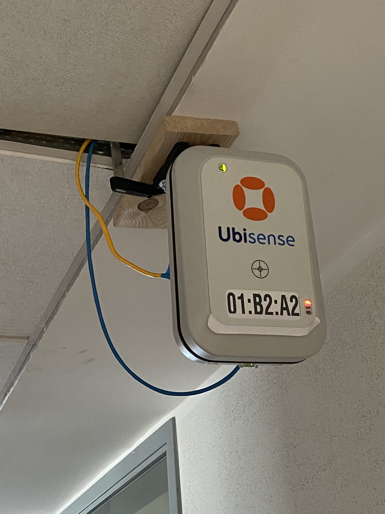
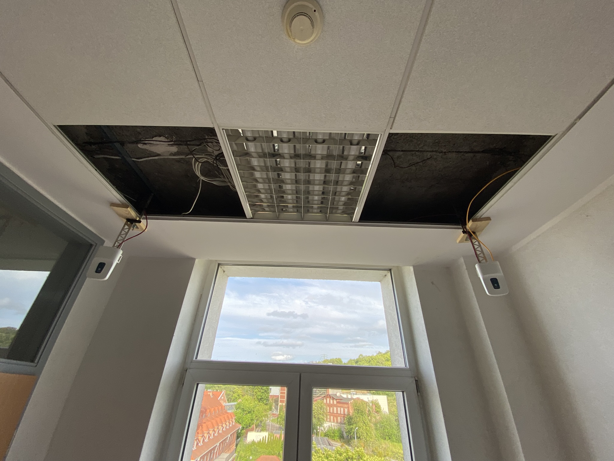
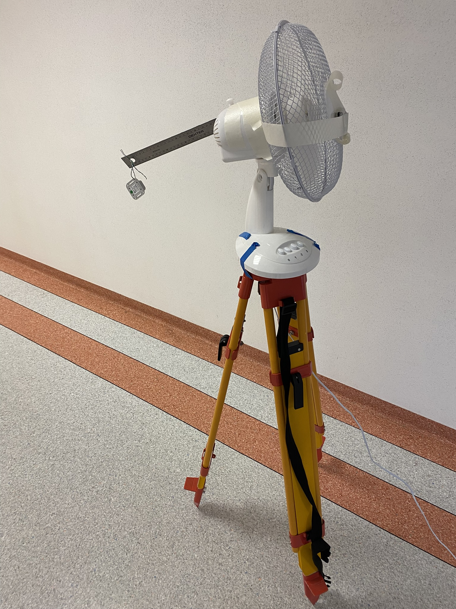

## 🧠 System Architecture & Data Flow

The architecture of the RTLS Middleware is designed for high throughput, asynchronous processing, and real-time data fusion. The diagram below illustrates the end-to-end pipeline from hardware sensors to the end-user frontend.

```mermaid
flowchart TB
    %% Styling
    classDef hardware fill:#1e293b,stroke:#334155,stroke-width:2px,color:#fff
    classDef parser fill:#3b82f6,stroke:#2563eb,stroke-width:2px,color:#fff
    classDef engine fill:#8b5cf6,stroke:#7c3aed,stroke-width:2px,color:#fff
    classDef output fill:#10b981,stroke:#059669,stroke-width:2px,color:#fff
    classDef storage fill:#f59e0b,stroke:#d97706,stroke-width:2px,color:#fff
    classDef logic fill:#334155,stroke:#475569,stroke-width:2px,color:#fff

    subgraph Hardware Layer
        P[Pozyx System]:::hardware -->|MQTT / JSON payload| R1(MQTT Subscriber):::parser
        U[Ubisense System]:::hardware -->|UDP / Binary stream| R2(UDP Datagram Protocol):::parser
    end

    subgraph Data_Ingestion [Data Ingestion & Preprocessing]
        R1 --> P1[JSON Parser & Dynamic Offsetting]:::parser
        R2 --> P2[Struct Unpack & Static Offsetting]:::parser
        P1 --> CS[(In-Memory Current State)]:::storage
        P2 --> CS
    end

    subgraph Core_Fusion [Core Fusion Engine Loop]
        CS --> TO{Timeout Check < 1.5s}:::logic
        TO --> ZL{Zone Validation Logic}:::logic
        ZL -->|X < 20m| Z1[Pozyx Exclusive Zone]:::engine
        ZL -->|X > 23.5m| Z2[Ubisense Exclusive Zone]:::engine
        ZL -->|20m < X < 23.5m| Z3[Weighted Average Fusion]:::engine
        Z1 --> VTS[Virtual Tag State Calculation]:::engine
        Z2 --> VTS
        Z3 --> VTS
    end

    subgraph Distribution [Data Distribution & Export]
        VTS --> WSM((WebSocket Manager)):::output
        VTS --> DR[(Data Recorder)]:::storage
        WSM --> F1[Live Web Corridors HTML5]:::output
        WSM --> F2[Vertical Mobile Maps]:::output
        DR --> C1[Continuous CSV Logging]:::storage
        DR --> C2[ML Raw Data Record]:::storage
    end

## 🚀 How It Works: The RTLS Integration Engine


*The main dashboard visualizing real-time tracking data from both Pozyx and Ubisense systems simultaneously.*

This application serves as a central processing hub designed to unify heterogeneous Ultra-Wideband (UWB) tracking environments. The asynchronous backend (built with Python and FastAPI) simultaneously ingests two entirely different data streams: raw JSON payloads via MQTT from the Pozyx system, and 40-byte binary UDP frames (OTW/ISO 24730) directly from the Ubisense server. 

The engine decodes these streams, translates their specific coordinate scales (e.g., millimeters to meters), and applies spatial calibration offsets to project them onto a single, shared Cartesian plane. The normalized telemetry is then broadcasted via WebSockets to the frontend, rendering a live 2D map with pinpoint accuracy, signal quality tracking, and latency metrics down to the millisecond.

---

## 🛠️ Hardware Infrastructure & Real-World Setup

This project wasn't just about writing software—it required extensive physical engineering, hardware modifications, and precise spatial calibration in a real-world test environment. 

Below is a behind-the-scenes look at the deployment of the heterogeneous RTLS infrastructure:

### 1. Precision Calibration

*Setting up the reference coordinate system. A green laser level was used in the calibration room to ensure millimeter-perfect alignment and geometry for the RTLS anchors.*

### 2. Hardware Modifications

*The central server PC required custom hardware modifications. Here, I am soldering a voltage booster to ensure stable power delivery for the system components.*

### 3. Network Infrastructure
.JPEG)
*A dedicated PoE (Power over Ethernet) switch installed in the suspended ceiling to power and connect the UWB tracking nodes.*

### 4. Ubisense Node Deployment

*One of the Ubisense Dimension4 sensors mounted to the ceiling infrastructure in the test corridor.*

### 5. Pozyx Node Deployment

*Pozyx UWB anchors mounted near the window in the test area, completing the heterogeneous hardware setup.*

### 6. Dynamic Movement Simulation

*To test the custom handover algorithm and system responsiveness, a Ubisense tag was attached to a rotating fan mounted on a surveying tripod. This creative solution provided consistent, predictable dynamic movement for testing the data pipeline.*
